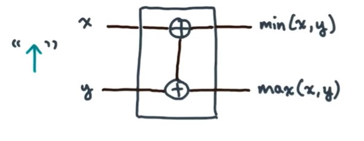

# Lesson 5: Comparison -based Sorting

Note:Read a short chapter on parallel merge sort
    Introduction to Algorithm

>>                          Comparator

>> 1.decreaing or minus comparator



-------------
2.increasing or plus comparator


>> Bitonic Sequences: the Sequences starts increasing, and then decreases. In addition,if this up and down property holds not for the original sequence,but it does hold for some circular shift of the Sequence,then the sequence is still bitonic.

## Bitonic Splits


Divide and conquer scheme:We know all elements of the max subsequence are greater than or equal to all elements of the min subsequence.

## Bitonic Merge
```
Bitonic Merge(A[0:n-1])
  if n>=2 then
      bitoinc Split(A[:])
spawn bitonic Merge(A[0:n/2-1])
      bitoinc Merge(A[n/2:n-1])

```
## Generate a bitonic Sequence
```
  genBitonic(A[0:n-1])
    if n>=2 then
      spawn genBitonic(A[0:n/2-1])
            genBitonic(A[n/2:n-1])
      sync
      spawn Bitonic Merge+(A[0:n/2-1])
            Bitoinc Merge-(A[n/2:n-1]);
```

## Bitoinc Sort
```
  bitonic Sort(A[0:n-1])
    genBitonic(A[:])
    bitoinc Merge+(A[:])
```

$$ W_{bs}(n) = \theta(n\log^{2}n)$$
$$ D_{bs}(n) = \theta(\log^{2}n) $$


