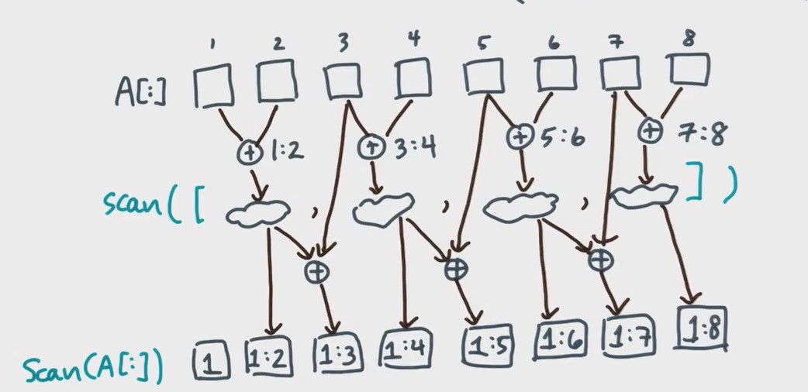
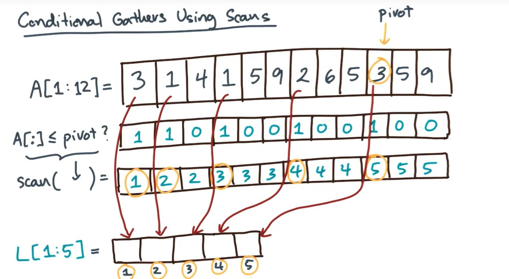
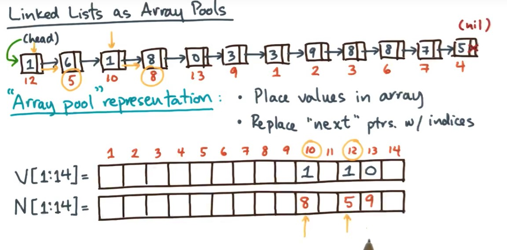

# Scans and List Ranking

## Scans

Prefix Sums:前缀和

Prefix Max

          scan operation


每一次递归 先算偶数 偶数进行再次递归 再算技术

```
  addScan(A[1:n])
    if n=1 then return A[1]
    let Io[1:n/2]=odd indices e.g. 1 3 5
    let Ie[1:n/2]=evens indices e.g. 2 4 6

    A[Ie]=A[Ie]+A[Io]
    A[Ie]=addScan(A[Ie])
    A[Io]=A[Ie[2:]]+A[Io[2:]]

```
$$ W(n)=n-1+W(\frac{n}{2}) ;n\geq2$$
$$ W(n)=O(n)$$

$$ D(n)=O(\log n)+D(n/2) ;n\geq2$$
$$ D(n)=O(\log^{2}n)$$

---------------------------

## Parallel Quicksort

```
QS(A[1:n])
  if n=1 then return A[1]
  pivot = array value from A(random)
  L={A[i]:A[i]<=pivot}
  R={A[i]:A[i]> pivot}
  AL=spawn QS(L)
  AR=QS(R)
  sync
  return AL++AR
```



```
compact 操作

L={A[i]:A[i]<=pivot}

get Smaller Equal(A[1:n],pivot)
    let F[1:n]=array of {0,1} flats
    F[:]=(A[:]<=pivot)

    let K[1:n]=array of indices
    K[:]=addScan(F[:])

    let L[1:K[n]]=output array
    par-for i=1 to n do
      if F[i]=1 the L[K[i]]=A[i]

    return L[:]
```
return gatherIf(A[:],F[:])   return A[F[:]]

--------------------------------

## Segmented Scans

the operation OP

```
let xi=(ai,fi)
  OP(xi,xj)
    if ! fj then
      return (ai+aj,fi|fj)
    return xj
```

----------------------

## List Ranking 链表

### Linked Lists as Array Pools



### Jump List

### Work Span

$$ W(n)=O(n\log n)$$  

is not optimal

$$ D(n)=O(\log^{2}n)$$
