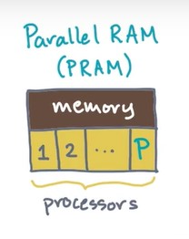
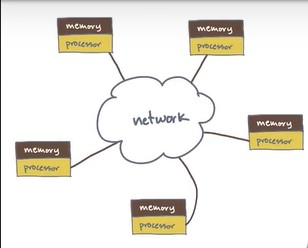
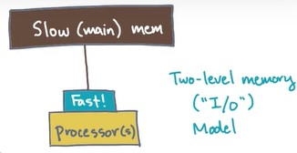
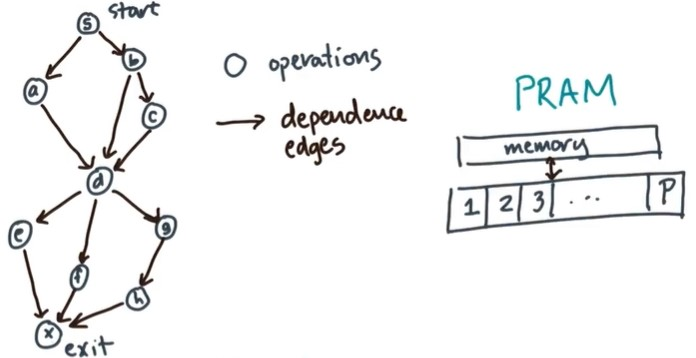
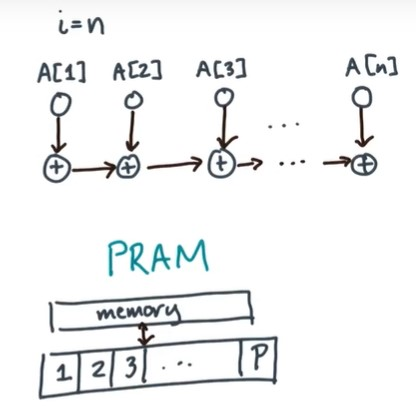
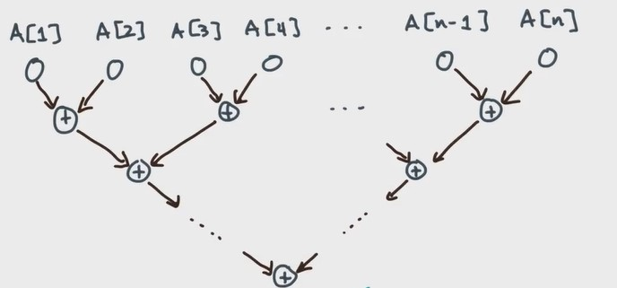
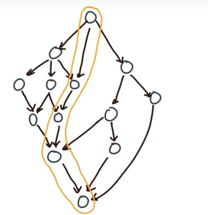
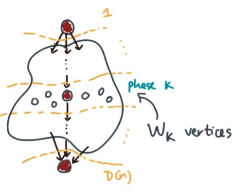
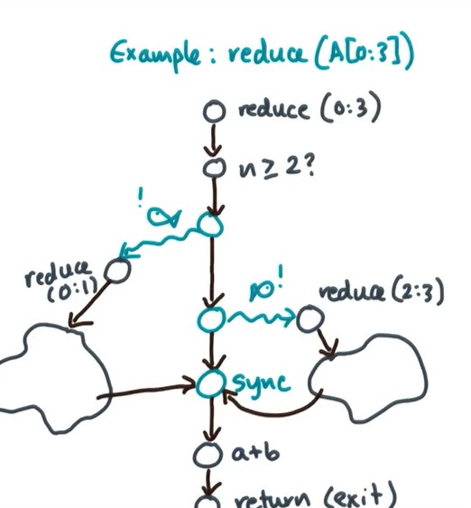

# The review of midterm

## Lesson 2:

>>  HPC(High performance computing):  Super computing
 The super in supercomputing is about solving big, hairy computational problems as efficiently as possible.

 1. Sequential ,or serial RAM model: There is a single serial processor connected to memory.

Analyze the cost of a serial RAM algorithm: You assume that all instructions have a cost that is bounded by some constant.

  The alternatives(可供替代的) to the serial RAM model:
  + A first alternative is the Parallel RAM or PRAM model: They all see the same memory, and you still assume a bounded constant cost per operation. But you get to work with more than one processor.

  

  And Since the processors all see the same memory, they can coordinate and communicate by modifying shared variables.
  A PRAM style model is arguably the simplest one that you might use on, a shared user multi-core machine with uniform memory access.

  But you'll try to reduce the total cost by up to a factor of - O(n logn /P);

  + One another alternative is a distributive memory or network model: It's basically just an interconnected network of RAMS. With multiple RAM computers.Each computer has a processor with its own private memory, but no processor and read or write the memory of any other. Instead,they join forces connecting to one another over a network.They coordinate by sending and receiving messages over this network.
  Yours analysis will count the number of messages, and the total volume of communication.

  
  + A two-level input output or ("I/o") Model:There are one or more processors connected to a main memory. It's sort of like RAM or PRAM ,but you assume that there's at least one level of fast memory that sitl in between the processors and the slower main memory(Such as Cache | Virtual memory).

  


## Lesson 3:

  >>Dynamic Multithreading Model:To design algorithms, we need an abstract model of a parallel computation.

  + The first state is that a computation can be represented by a directed acyclic graph or DAG sort of like this one.
    Each node is some piece of computational work or task;
    From the point of view of exploiting parallelism, a good DAG is one that has relatively few dependencies compared to the number of tasks.

  + A pseudocode notation(|伪代码 or a programming model)

###  DAG model
  

  Each vertex is an operation,like a plus or an addition or a function call or
  a branch. The directed edges show you how operations depend on one another.

  ```
Sequential Reduction:
   let A is an array of lenth n
   s=0;
   for i=1:n do
    S=S+A[i]
  ```
  Suppose we only care about the cost of addition(+) and cost of array access(A[i])[ignore the index and others].

  

  $$ T(n)\geq O(\lceil\frac{n}{P}\rceil) $$

  We can't ever execute a given addition until I've executed the previous addition. The processors how many you have, not useful.

  Thus,
  $$ T(n)\geq O(n) $$

  But look this:

  

  If the Processors
  $$P\geq n$$
  any level of addition will take one unit of time or just constant time. Level by Level!
  $$T(n)=O(\log n)$$

### Work and Span


The number of veritices depend the input : we call it Work, W(n);

The longest path through the dag(critical path|depth): we call it Span, D(n);

Due to
  $$T_{P}(n)=?$$
$$T_{1}(n)=W(n)$$
$$T_{\infty}(n)=D(n)$$

#### Basic Work-Span Laws
  $$\frac{W(n)}{D(n)}$$
  measures the amount of work per critical path vertex. It's the average available parallelism.
Span Law:
  $$ T(n)\geq D(n) $$
Work Law:
  $$ T(n)\geq O(\lceil\frac{W(n)}{P}\rceil) $$

#### Brent's Theorem
  We can think the execution into phases(阶段 层级):
  1. Each phase has exactly one critical path vertex.
  2. All non critical path vertices within a phase are independent.
  3. Every vertex has to be in some phases,but it should only be in one phase.

  
  Firstly,We can define the Kth phase has

  $$ W_{k} $$
  vertices.
  Secondly,using (3.)
  We will get
  $$\sum_{n=1}^{D}W_{n}=W$$
  Using (2.) and the last introduction
  $$t_{k}=\lceil\frac{W_{k}}{P}\rceil$$
  $$\Rightarrow T_{p}=\sum_{k=1}^{D}\lceil\frac{W_{k}}{P}\rceil$$

  The true identities:
  $$\lceil \frac{a}{b}\rceil=\lfloor \frac{a+b-1}{b}\rfloor$$
  $$\lceil \frac{a}{b}\rceil=\lfloor \frac{a-1}{b}\rfloor+1$$
  $$\lfloor \frac{a}{b}\rfloor=\lceil \frac{a-b+1}{b}\rceil$$
  $$\lfloor \frac{a}{b}\rfloor=\lceil \frac{a+1}{b}\rceil-1$$

  Thus,
  $$T_{p}=\sum_{k=1}^{D}\lceil\frac{W_{k}}{P}\rceil$$
  $$\Rightarrow T_{p}= \sum_{k=1}^{D} \lfloor \frac{W_{k}-1}{P}\rfloor+1$$
  $$\Rightarrow T_{p} \leq\sum_{k=1}^{D} \frac{W_{k}-1}{P}+1$$
  $$\Rightarrow T_{p} \leq \frac{W-D}{P}+D$$

  >>Brent's Theorem says that the time to execute the DAG is no more than the time to execute the critical path,plus the time to execute off of the critical path using the P processors.

  Now an interesting factoid is that this upper limit and this lower limit are both within a factor of two of one another.
  In any case,what this means is that you may be able to execute the DAG in a time that is less than what Brent predicts. Though of course you can never go any faster than the lower bound at least in theory.

#### Speedup
>>Speedup is defined as **the best sequential time** divided by the parallel time.

$$Sp(n)=\frac{T^{ * }(n)}{T_{P}(n)}$$

Ideal Speedup:Linear in P;
$$Sp(n)=\theta(p)$$

According to
$$ Sp(n)\geq\frac{P}{\frac{W}{W\prime} + \frac{P-1}{ \frac{W\prime}{D} } }$$

If we will make the Speed(n) to be P:
+ work-iptimality-the work of the parallel algorithm has to match the work of the best sequential algorithm.
+ weak-scalability-the work per processor has to grow as some function of n.(As you increase the concurrency of the machine,then if you want to get good scaling,you might need to increase the problem size.)

#### spawn&sync
>>Spawn: A signal to either the compiler or the runtime system that the target is an independent unit of work.
Sync: Wait for any spawn that has occurred so far within the same stack frame.

```
reduce(A[0:n-1])
  if n>=2 then
    a= spwn reduce(A[0:n/2-1])
    b= spwn reduce(B[n/2:n-1])
    Sync
    return a+b;
    returen A[0];
```
Notice:
    1.the positin of sync;
    2.the second spwn can be deleted;

  

  if you delete the second spwn, it won't effect the concurrency.

sequential version Analysis:
  if n>=2
  $$T^{ * }(n) = 2 * T^{ * }(\frac{n}{2})+O(1)$$
  if n<=1
  $$T^{ * }(n) =O(1)$$
Thus,
$$T^{ * }(n) =O(n)$$

parallel version Snalysis:
if n>=2
$$W(n) = 2 * W(\frac{n}{2})+O(1)$$
if n<=1
$$W(n) =O(1)$$
Thus,
$$W(n) =O(n)$$

if n>=2
$$D(n) = 2 * W(\frac{n}{2})+O(1)$$
if n<=1
$$D(n) =O(1)$$
Thus,
$$D(n) =O(\log(n))$$
Be careful the O(1)!

Remember the principle of poly-logarithmic span
$$ D(n)=O(long^{n}(n))$$

```
par-for i=1 to n do
  foo(i)

//implicit sync
```  
par-for:you are saying that all iterations are independent of one another.

```
//Computes: y=y+A*x Matrix-Vector
for i = 1 to n do
  for j = 1 to n do
    y[i]=y[i]+A[i,j]*x[j]
```
We can find the first "for" can parallel.

y[i] is the Data race for the second "for"
>>Data race :At least one read & one write that can happen at the same memory location at the same time;(体系结构 操作系统中都很常见)
